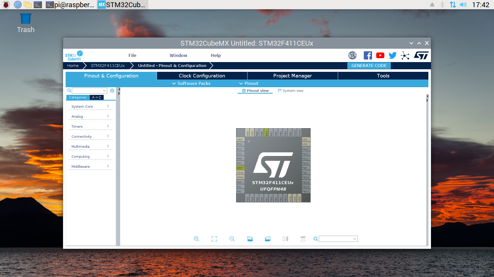

# Raspberry Jottings
Notes how to compile and install on raspberry pi
## micropython
	tar xvf ~/Downloads/micropython-1.12.tar.xz
	cd micropython-1.12/
	cd mpy-cross/
	make
	cd ../ports/unix/
	make
	
## ScanTailor
	sudo apt-get update
	sudo apt-get install build-essential git cmake libqt4-dev libboost-all-dev libjpeg-dev libtiff-dev libxrender-dev zlib1g-dev libpng12-dev 
	git clone https://github.com/scantailor/scantailor.git
	cd scantailor/
	cmake -DCMAKE_INSTALL_PREFIX=/usr .
	make
	sudo make install

## openocd
	sudo apt-get install git autoconf libtool make pkg-config libusb-1.0-0 libusb-1.0-0-dev  libhidapi-dev libftdi1-dev libjaylink-dev libusb-dev
	git clone http://openocd.zylin.com/openocd
	cd openocd
	./bootstrap
	./configure --enable-sysfsgpio --enable-bcm2835gpio
	make
	make install
	
## orbunculum

```
git clone https://github.com/orbcode/orbuculum
cd orbuculum
apt-get install libelf-dev libiberty-dev  binutils-dev
make 
```

## bmtrace

(from Black Magic Probe Book)

```
apt-get install libbsd-dev libglfw3-dev libusb-1.0.0-dev libgtk-3-dev git
git clone https://github.com/compuphase/Black-Magic-Probe-Book
cd Black-Magic-Probe-Book/source
GLFW_LIBNAME=glfw make -f Makefile.linux
```

## STM32CubeMX

Check java is installed:
```
pi@raspberrypi:~ $ java --version
openjdk 11.0.15 2022-04-19
OpenJDK Runtime Environment (build 11.0.15+10-post-Debian-1deb11u1)
OpenJDK 64-Bit Server VM (build 11.0.15+10-post-Debian-1deb11u1, mixed mode)
```
Download stm32cubemx for linux:
```
pi@raspberrypi:~ $ ls -l en.stm32cubemx-lin_v6-5-0.zip 
-rw-r--r-- 1 root root 414664915 May 16 17:35 en.stm32cubemx-lin_v6-5-0.zip
```
Unzip and install:
```
pi@raspberrypi:~ $ mkdir xxx
pi@raspberrypi:~ $ cd xxx/
pi@raspberrypi:~/xxx $ unzip -q ../en.stm32cubemx-lin_v6-5-0.zip 
pi@raspberrypi:~/xxx $ ls
jre  Readme.html  SetupSTM32CubeMX-6.5.0
pi@raspberrypi:~/xxx $ java -jar ./SetupSTM32CubeMX-6.5.0
```
Run STM32CubeMX from the installation directory:
```
pi@raspberrypi:~/xxx $ cd ~/STM32CubeMX/
pi@raspberrypi:~/STM32CubeMX $ ls 
db    jre    plugins      third_parties_plugins  utilities
help  olddb  STM32CubeMX  Uninstaller
pi@raspberrypi:~/STM32CubeMX $ java -jar ./STM32CubeMX
```


 
## tvheadend

```
sudo apt-get install build-essential git pkg-config libssl-dev bzip2 wget
sudo apt-get install libavahi-client-dev zlib1g-dev libavcodec-dev libavutil-dev libavformat-dev libswscale-dev libavresample-dev libdvbcsa-dev liburiparser-dev libhdhomerun-dev libavfilter-dev libx264-dev libx265-dev libvpx-dev libopus-dev
git clone https://github.com/tvheadend/tvheadend
cd tvheadend
# sh ./Autobuild.sh
./configure --disable-ffmpeg_static --disable-libfdkaac_static --disable-libtheora_static --disable-libopus_static --disable-libvorbis_static --disable-libvpx_static --disable-libx264_static --disable-libx265_static --disable-libfdkaac --enable-libopus --enable-libvorbis --enable-libvpx --enable-libx264 --enable-libx265 --disable-avahi --disable-dbus_1 --disable-bintray_cache --disable-hdhomerun_static --enable-hdhomerun_client --enable-libav --enable-pngquant --enable-trace --infodir=/usr/share/info --localstatedir=/var --mandir=/usr/share/man --prefix=/usr --sysconfdir=/srv/config
make
make install
```

## micro-manager

http://micro-manager.org
raspberry pi os (64 bit):

needs "swig" to be version 3.

```
sudo apt install libpcre3-dev
curl -LO https://prdownloads.sourceforge.net/swig/swig-3.0.12.tar.gz
tar xzf swig-3.0.12.tar.gz
cd swig-3.0.12
./configure
make -j3
sudo make install
export PATH=/usr/local/bin:$PATH
sudo apt-get install autoconf automake libtool pkg-config swig ant libboost-dev libboost-all-dev 
sudo apt-get install imagej libfreeimageplus-dev libhidapi-dev libmodbus-dev libgphoto2-dev libusb-dev libopencv-dev


svn co https://valelab4.ucsf.edu/svn/3rdpartypublic/
git clone --recursive https://github.com/micro-manager/micro-manager
cd micro-manager/
./autogen.sh
./configure --prefix=/opt/micro-manager --with-ij-jar=/usr/share/java/ij.jar --with-python=/usr/include/python3.9 --with-boost-libdir=/usr/lib/aarch64-linux-gnu/ --with-boost=/usr/include/boost
make fetchdeps
make
sudo make install
```

When working on a high-dpi display, either 

```
GDK_SCALE=2 micromanager
```
or, in /opt/micro-manager/bin/micromanager , add

```
-Dsun.java2d.uiScale=2
```
as option to  org.micromanager.internal.MMStudio

not truncated
