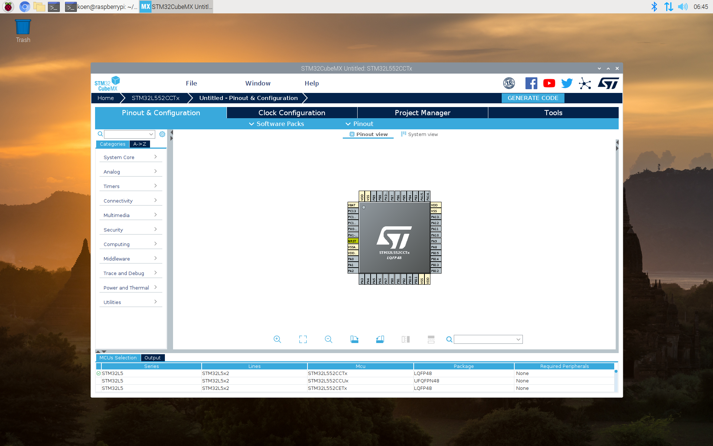

# Raspberry Jottings
Notes how to compile and install on raspberry pi
## micropython
	tar xvf ~/Downloads/micropython-1.12.tar.xz
	cd micropython-1.12/
	cd mpy-cross/
	make
	cd ../ports/unix/
	make
	
## ScanTailor
	sudo apt-get update
	sudo apt-get install build-essential git cmake libqt4-dev libboost-all-dev libjpeg-dev libtiff-dev libxrender-dev zlib1g-dev libpng12-dev 
	git clone https://github.com/scantailor/scantailor.git
	cd scantailor/
	cmake -DCMAKE_INSTALL_PREFIX=/usr .
	make
	sudo make install

## openocd
	sudo apt-get install git autoconf libtool make pkg-config libusb-1.0-0 libusb-1.0-0-dev  libhidapi-dev libftdi1-dev libjaylink-dev libusb-dev
	git clone http://openocd.zylin.com/openocd
	cd openocd
	./bootstrap
	./configure --enable-sysfsgpio --enable-bcm2835gpio
	make
	make install
	
## orbunculum

```
git clone https://github.com/orbcode/orbuculum
cd orbuculum
apt-get install libelf-dev libiberty-dev  binutils-dev
make 
```	

## bmtrace

(from Black Magic Probe Book)

```
apt-get install libbsd-dev libglfw3-dev libusb-1.0.0-dev libgtk-3-dev git
git clone https://github.com/compuphase/Black-Magic-Probe-Book
cd Black-Magic-Probe-Book/source
GLFW_LIBNAME=glfw make -f Makefile.linux
```

## STM32CubeMX

Make sure java is installed
```
 $ java -version 
openjdk version "11.0.12" 2021-07-20
OpenJDK Runtime Environment (build 11.0.12+7-post-Debian-2deb10u1)
OpenJDK 64-Bit Server VM (build 11.0.12+7-post-Debian-2deb10u1, mixed mode)

```
Download and unzip [STM32CubeMX](https://www.st.com/en/development-tools/stm32cubemx.html) for linux:
```
unzip en.stm32cubemx-lin_v6-3-0.zip
```
Start installer
```
/opt/jdk1.8.0_251/bin/java -jar ./SetupSTM32CubeMX-6.3.0
```
Execute STM32CubeMX from install directory
```
/opt/jdk1.8.0_251/bin/java -jar ./STM32CubeMX
```
STM32CubeMX for Linux installs its own JRE runtime environment. Unfortunately, the JRE is for x86, not arm. Replace x86 binary with an arm binary, and make sure the arm binary will not be overwritten.
```
$ cd ~/.stm32cubemx/plugins/updater/loadedSoftware/jre/bin
$ file java
java: ELF 64-bit LSB shared object, x86-64, version 1 (SYSV), dynamically linked, interpreter /lib64/ld-linux-x86-64.so.2, for GNU/Linux 2.6.18, not stripped
$ rm java
$ sudo cp /etc/alternatives/java .
$ rm unpack200
$ sudo cp /usr/bin/unpack200 .
```
At this point, STM32CubeMX should work:
```
java -jar ./STM32CubeMX
```


Uninstaller:
```
/opt/jdk1.8.0_251/bin/java -jar STM32CubeMX/Uninstaller/uninstaller.jar
```

## tvheadend

```
sudo apt-get install build-essential git pkg-config libssl-dev bzip2 wget
sudo apt-get install libavahi-client-dev zlib1g-dev libavcodec-dev libavutil-dev libavformat-dev libswscale-dev libavresample-dev libdvbcsa-dev liburiparser-dev libhdhomerun-dev libavfilter-dev libx264-dev libx265-dev libvpx-dev libopus-dev
git clone https://github.com/tvheadend/tvheadend
cd tvheadend
# sh ./Autobuild.sh
./configure --disable-ffmpeg_static --disable-libfdkaac_static --disable-libtheora_static --disable-libopus_static --disable-libvorbis_static --disable-libvpx_static --disable-libx264_static --disable-libx265_static --disable-libfdkaac --enable-libopus --enable-libvorbis --enable-libvpx --enable-libx264 --enable-libx265 --disable-avahi --disable-dbus_1 --disable-bintray_cache --disable-hdhomerun_static --enable-hdhomerun_client --enable-libav --enable-pngquant --enable-trace --infodir=/usr/share/info --localstatedir=/var --mandir=/usr/share/man --prefix=/usr --sysconfdir=/srv/config
make
make install
```

## micro-manager
``` 
http://micro-manager.org
raspberry pi os (64 bit):

sudo apt-get install autoconf automake libtool pkg-config swig ant libboost-dev libboost-all-dev 
sudo apt-get install imagej libfreeimageplus-dev libhidapi-dev libmodbus-dev libgphoto2-dev libusb-dev libopencv-dev
git clone --recursive https://github.com/micro-manager/micro-manager
cd micro-manager/
./autogen.sh
./configure --prefix=/opt/micro-manager --with-ij-jar=/usr/share/java/ij.jar --with-python=/usr/include/python3.9 --with-boost-libdir=/usr/lib/aarch64-linux-gnu/ --with-boost=/usr/include/boost
make fetchdeps
make
sudo make install
```

not truncated
